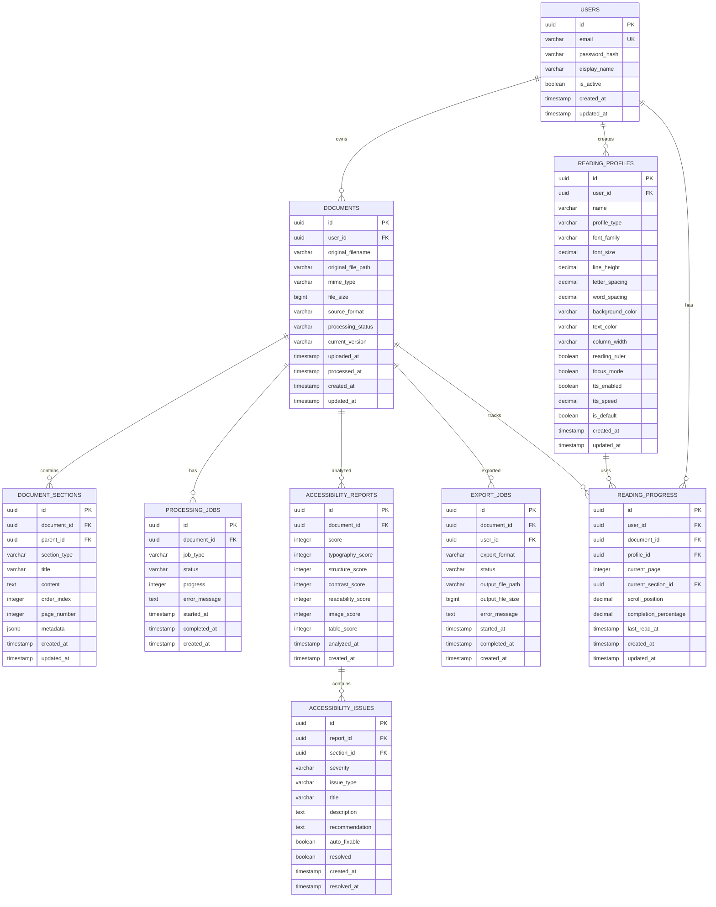

# ReadAble — Entity Relationship Diagram

> Version: 1.0
> Status: MVP Database Design
> Product: ReadAble
> Purpose: Universal Accessible Document Converter
> Database: PostgreSQL
> ORM Recommendation: SQLAlchemy 2.0

---

# 01. Database Overview

ReadAble membutuhkan database untuk menyimpan:

- User
- Documents
- Document processing status
- Extracted document structure
- Reading profiles
- User reading preferences
- Accessibility analysis
- Accessibility issues
- Export jobs
- Exported files
- Reading progress

Core relationship:

```text
USER
 │
 ├── DOCUMENTS
 │      │
 │      ├── DOCUMENT_SECTIONS
 │      │
 │      ├── PROCESSING_JOBS
 │      │
 │      ├── ACCESSIBILITY_REPORTS
 │      │       │
 │      │       └── ACCESSIBILITY_ISSUES
 │      │
 │      ├── READING_PROGRESS
 │      │
 │      └── EXPORT_JOBS
 │
 └── READING_PROFILES
````

---

# 02. ERD



---

# 03. Entity List

| Entity                  | Purpose                       |
| ----------------------- | ----------------------------- |
| `users`                 | User accounts                 |
| `documents`             | Uploaded documents            |
| `document_sections`     | Parsed document structure     |
| `processing_jobs`       | Document conversion pipeline  |
| `reading_profiles`      | User reading configurations   |
| `reading_progress`      | Reading position              |
| `accessibility_reports` | Accessibility score           |
| `accessibility_issues`  | Problems detected in document |
| `export_jobs`           | Export/conversion requests    |

---

# 04. USERS

Stores application users.

## Table

```text
users
```

## Columns

| Column          | Type         | Constraint       | Description        |
| --------------- | ------------ | ---------------- | ------------------ |
| `id`            | UUID         | PK               | User identifier    |
| `email`         | VARCHAR(255) | UNIQUE, NOT NULL | Login email        |
| `password_hash` | TEXT         | NOT NULL         | Hashed password    |
| `display_name`  | VARCHAR(100) | NULL             | Display name       |
| `is_active`     | BOOLEAN      | DEFAULT TRUE     | Account status     |
| `created_at`    | TIMESTAMP    | NOT NULL         | Creation timestamp |
| `updated_at`    | TIMESTAMP    | NOT NULL         | Last update        |

## Index

```sql
CREATE UNIQUE INDEX idx_users_email
ON users(email);
```

---

# 05. DOCUMENTS

Stores original uploaded documents.

## Table

```text
documents
```

## Columns

| Column               | Type         | Constraint    | Description           |
| -------------------- | ------------ | ------------- | --------------------- |
| `id`                 | UUID         | PK            | Document ID           |
| `user_id`            | UUID         | FK            | Owner                 |
| `original_filename`  | VARCHAR(255) | NOT NULL      | Original filename     |
| `original_file_path` | TEXT         | NOT NULL      | Storage location      |
| `mime_type`          | VARCHAR(100) | NOT NULL      | MIME type             |
| `file_size`          | BIGINT       | NOT NULL      | File size             |
| `source_format`      | VARCHAR(20)  | NOT NULL      | PDF/DOCX/etc          |
| `processing_status`  | VARCHAR(30)  | NOT NULL      | Processing state      |
| `current_version`    | VARCHAR(20)  | DEFAULT '1.0' | Document version      |
| `uploaded_at`        | TIMESTAMP    | NOT NULL      | Upload time           |
| `processed_at`       | TIMESTAMP    | NULL          | Processing completion |
| `created_at`         | TIMESTAMP    | NOT NULL      | Creation              |
| `updated_at`         | TIMESTAMP    | NOT NULL      | Update                |

## Relationship

```text
users 1 ──────── N documents
```

---

# 06. Document Processing Status

Recommended enum:

```text
UPLOADED
QUEUED
PROCESSING
COMPLETED
FAILED
CANCELLED
```

Flow:

```text
UPLOADED
   ↓
QUEUED
   ↓
PROCESSING
   ↓
COMPLETED
```

Error:

```text
PROCESSING
   ↓
FAILED
```

---

# 07. DOCUMENT_SECTIONS

Stores the semantic structure extracted from the document.

This is one of the most important tables.

A document is not stored merely as a large text blob.

Instead:

```text
Document
   ↓
Section
   ↓
Paragraph
   ↓
Text
```

## Table

```text
document_sections
```

## Columns

| Column         | Type        | Description            |
| -------------- | ----------- | ---------------------- |
| `id`           | UUID        | Section ID             |
| `document_id`  | UUID        | Parent document        |
| `parent_id`    | UUID        | Parent section         |
| `section_type` | VARCHAR(30) | Content type           |
| `title`        | TEXT        | Heading/title          |
| `content`      | TEXT        | Text content           |
| `order_index`  | INTEGER     | Reading order          |
| `page_number`  | INTEGER     | Original page          |
| `metadata`     | JSONB       | Additional information |
| `created_at`   | TIMESTAMP   | Creation               |
| `updated_at`   | TIMESTAMP   | Update                 |

---

# 08. Section Types

Recommended values:

```text
DOCUMENT
H1
H2
H3
PARAGRAPH
QUOTE
LIST
LIST_ITEM
IMAGE
CAPTION
TABLE
TABLE_ROW
TABLE_CELL
FOOTNOTE
PAGE_BREAK
```

Example:

```text
DOCUMENT
│
├── H1
│
├── PARAGRAPH
│
├── H2
│   │
│   ├── PARAGRAPH
│   ├── IMAGE
│   └── CAPTION
│
└── H2
    │
    ├── PARAGRAPH
    └── TABLE
```

---

# 09. Hierarchical Relationship

`document_sections.parent_id` references itself.

```text
document_sections
       │
       └── parent_id
               ↓
       document_sections.id
```

Example:

```text
Chapter 1
    │
    ├── Introduction
    │       ├── Paragraph
    │       └── Paragraph
    │
    └── Methodology
            └── Paragraph
```

This allows ReadAble to reconstruct document hierarchy.

---

# 10. PROCESSING_JOBS

Tracks every document-processing operation.

## Table

```text
processing_jobs
```

## Columns

| Column          | Type        | Description     |
| --------------- | ----------- | --------------- |
| `id`            | UUID        | Job ID          |
| `document_id`   | UUID        | Target document |
| `job_type`      | VARCHAR(50) | Processing type |
| `status`        | VARCHAR(30) | Job status      |
| `progress`      | INTEGER     | 0–100           |
| `error_message` | TEXT        | Error details   |
| `started_at`    | TIMESTAMP   | Start time      |
| `completed_at`  | TIMESTAMP   | Completion      |
| `created_at`    | TIMESTAMP   | Creation        |

---

# 11. Processing Job Types

```text
TEXT_EXTRACTION
STRUCTURE_ANALYSIS
READING_ORDER
ACCESSIBILITY_ANALYSIS
DOCUMENT_REFLOW
EXPORT
```

Example:

```text
TEXT_EXTRACTION
       ↓
STRUCTURE_ANALYSIS
       ↓
READING_ORDER
       ↓
DOCUMENT_REFLOW
       ↓
ACCESSIBILITY_ANALYSIS
       ↓
EXPORT
```

---

# 12. READING_PROFILES

Stores reading preferences.

The profile system is central to ReadAble.

The product should not assume that every dyslexic reader needs exactly the same settings.

## Table

```text
reading_profiles
```

## Columns

| Column             | Type         | Description     |
| ------------------ | ------------ | --------------- |
| `id`               | UUID         | Profile ID      |
| `user_id`          | UUID         | Profile owner   |
| `name`             | VARCHAR(100) | Profile name    |
| `profile_type`     | VARCHAR(30)  | Preset/custom   |
| `font_family`      | VARCHAR(100) | Reading font    |
| `font_size`        | DECIMAL      | Font size       |
| `line_height`      | DECIMAL      | Line height     |
| `letter_spacing`   | DECIMAL      | Letter spacing  |
| `word_spacing`     | DECIMAL      | Word spacing    |
| `background_color` | VARCHAR(20)  | Background      |
| `text_color`       | VARCHAR(20)  | Text color      |
| `column_width`     | VARCHAR(20)  | Reading width   |
| `reading_ruler`    | BOOLEAN      | Ruler enabled   |
| `focus_mode`       | BOOLEAN      | Focus mode      |
| `tts_enabled`      | BOOLEAN      | TTS             |
| `tts_speed`        | DECIMAL      | TTS speed       |
| `is_default`       | BOOLEAN      | Default profile |
| `created_at`       | TIMESTAMP    | Creation        |
| `updated_at`       | TIMESTAMP    | Update          |

---

# 13. Profile Types

Preset:

```text
STANDARD
DYSLEXIA_FRIENDLY
FOCUS_READING
HIGH_CONTRAST
```

Custom:

```text
CUSTOM
```

Example:

```text
Dyslexia Friendly
│
├── Lexend
├── 18px
├── 1.8 line height
├── increased spacing
├── warm background
└── narrow column
```

---

# 14. READING_PROGRESS

Stores the user's reading state.

## Table

```text
reading_progress
```

## Columns

| Column                  | Type      | Description        |
| ----------------------- | --------- | ------------------ |
| `id`                    | UUID      | Progress ID        |
| `user_id`               | UUID      | Reader             |
| `document_id`           | UUID      | Document           |
| `profile_id`            | UUID      | Active profile     |
| `current_page`          | INTEGER   | Current page       |
| `current_section_id`    | UUID      | Current section    |
| `scroll_position`       | DECIMAL   | Scroll position    |
| `completion_percentage` | DECIMAL   | Reading completion |
| `last_read_at`          | TIMESTAMP | Last activity      |
| `created_at`            | TIMESTAMP | Creation           |
| `updated_at`            | TIMESTAMP | Update             |

---

# 15. Progress Relationship

```text
USER
 │
 └── READING_PROGRESS
          │
          ├── DOCUMENT
          │
          ├── SECTION
          │
          └── PROFILE
```

Example:

```text
Rafif
  ↓
Research Paper.pdf
  ↓
Chapter 3
  ↓
67% complete
  ↓
Dyslexia Friendly Profile
```

---

# 16. ACCESSIBILITY_REPORTS

Stores the accessibility analysis result.

## Table

```text
accessibility_reports
```

## Columns

| Column              | Type      | Description         |
| ------------------- | --------- | ------------------- |
| `id`                | UUID      | Report ID           |
| `document_id`       | UUID      | Document            |
| `score`             | INTEGER   | Overall score       |
| `typography_score`  | INTEGER   | Typography          |
| `structure_score`   | INTEGER   | Structure           |
| `contrast_score`    | INTEGER   | Contrast            |
| `readability_score` | INTEGER   | Readability         |
| `image_score`       | INTEGER   | Image accessibility |
| `table_score`       | INTEGER   | Table accessibility |
| `analyzed_at`       | TIMESTAMP | Analysis time       |
| `created_at`        | TIMESTAMP | Creation            |

---

# 17. Accessibility Score

Overall score:

```text
0–100
```

Suggested weighting:

```text
Typography          20%
Structure           20%
Readability         20%
Contrast            15%
Images              10%
Tables              10%
Reading Order        5%
```

Formula:

```text
score =
    typography_score × 0.20
  + structure_score × 0.20
  + readability_score × 0.20
  + contrast_score × 0.15
  + image_score × 0.10
  + table_score × 0.10
  + reading_order_score × 0.05
```

> The weighting is a product heuristic, not a clinical or official accessibility standard.

---

# 18. ACCESSIBILITY_ISSUES

Stores individual accessibility problems.

## Table

```text
accessibility_issues
```

## Columns

| Column           | Type         | Description                |
| ---------------- | ------------ | -------------------------- |
| `id`             | UUID         | Issue ID                   |
| `report_id`      | UUID         | Report                     |
| `section_id`     | UUID         | Related section            |
| `severity`       | VARCHAR(20)  | Severity                   |
| `issue_type`     | VARCHAR(50)  | Issue category             |
| `title`          | VARCHAR(255) | Issue title                |
| `description`    | TEXT         | Explanation                |
| `recommendation` | TEXT         | Suggested fix              |
| `auto_fixable`   | BOOLEAN      | Can be automatically fixed |
| `resolved`       | BOOLEAN      | Resolution status          |
| `created_at`     | TIMESTAMP    | Creation                   |
| `resolved_at`    | TIMESTAMP    | Resolution                 |

---

# 19. Issue Severity

```text
INFO
WARNING
ERROR
CRITICAL
```

Example:

```text
WARNING

Long Paragraph

Page 12 contains a paragraph
with unusually high text density.

Recommendation:
Split the paragraph into smaller
semantic blocks.
```

---

# 20. Issue Types

Recommended:

```text
LONG_PARAGRAPH
LOW_CONTRAST
MISSING_ALT_TEXT
BROKEN_HEADING_HIERARCHY
COMPLEX_TABLE
SMALL_FONT
TIGHT_LINE_SPACING
TIGHT_LETTER_SPACING
READING_ORDER
MISSING_CAPTION
ORPHAN_HEADING
```

---

# 21. EXPORT_JOBS

Tracks document exports.

## Table

```text
export_jobs
```

## Columns

| Column             | Type        | Description     |
| ------------------ | ----------- | --------------- |
| `id`               | UUID        | Export ID       |
| `document_id`      | UUID        | Source document |
| `user_id`          | UUID        | Requesting user |
| `export_format`    | VARCHAR(20) | PDF/EPUB/etc    |
| `status`           | VARCHAR(30) | Export status   |
| `output_file_path` | TEXT        | Output location |
| `output_file_size` | BIGINT      | Output size     |
| `error_message`    | TEXT        | Error           |
| `started_at`       | TIMESTAMP   | Start           |
| `completed_at`     | TIMESTAMP   | Completion      |
| `created_at`       | TIMESTAMP   | Creation        |

---

# 22. Export Formats

MVP:

```text
PDF
EPUB
DOCX
HTML
```

Recommended priority:

```text
1. PDF
2. EPUB
3. DOCX
4. HTML
```

---

# 23. Export Status

```text
QUEUED
PROCESSING
COMPLETED
FAILED
CANCELLED
```

---

# 24. Complete Relationship Map

```text
                         ┌──────────────────┐
                         │      USERS       │
                         └────────┬─────────┘
                                  │
              ┌───────────────────┼───────────────────┐
              │                   │                   │
              ▼                   ▼                   ▼
       ┌─────────────┐    ┌───────────────┐   ┌───────────────┐
       │  DOCUMENTS  │    │    PROFILES   │   │    PROGRESS   │
       └──────┬──────┘    └───────────────┘   └───────┬───────┘
              │                                       │
      ┌───────┼───────────────┬───────────────┐       │
      │       │               │               │       │
      ▼       ▼               ▼               ▼       ▼
  SECTIONS  JOBS          REPORTS         EXPORTS   PROFILE
              │               │
              │               ▼
              │          ┌───────────────┐
              │          │    ISSUES     │
              │          └───────────────┘
              │
              ▼
       PROCESSING PIPELINE
```

---

# 25. Foreign Keys

## Documents

```sql
documents.user_id
    REFERENCES users(id)
```

## Document Sections

```sql
document_sections.document_id
    REFERENCES documents(id)

document_sections.parent_id
    REFERENCES document_sections(id)
```

## Processing Jobs

```sql
processing_jobs.document_id
    REFERENCES documents(id)
```

## Profiles

```sql
reading_profiles.user_id
    REFERENCES users(id)
```

## Reading Progress

```sql
reading_progress.user_id
    REFERENCES users(id)

reading_progress.document_id
    REFERENCES documents(id)

reading_progress.profile_id
    REFERENCES reading_profiles(id)

reading_progress.current_section_id
    REFERENCES document_sections(id)
```

## Accessibility Reports

```sql
accessibility_reports.document_id
    REFERENCES documents(id)
```

## Accessibility Issues

```sql
accessibility_issues.report_id
    REFERENCES accessibility_reports(id)

accessibility_issues.section_id
    REFERENCES document_sections(id)
```

## Export Jobs

```sql
export_jobs.document_id
    REFERENCES documents(id)

export_jobs.user_id
    REFERENCES users(id)
```

---

# 26. Cascade Rules

Recommended:

```text
DELETE USER
    ↓
DELETE DOCUMENTS
    ↓
DELETE SECTIONS
DELETE PROCESSING JOBS
DELETE REPORTS
DELETE EXPORT JOBS
DELETE PROGRESS
```

For document sections:

```text
DELETE DOCUMENT
    ↓
DELETE ALL CHILD SECTIONS
```

For reports:

```text
DELETE REPORT
    ↓
DELETE ISSUES
```

Use database-level cascade where appropriate.

---

# 27. Important Constraints

## User

```text
email UNIQUE
```

## Document

```text
file_size > 0
```

## Accessibility Score

```text
score BETWEEN 0 AND 100
```

## Progress

```text
completion_percentage BETWEEN 0 AND 100
```

## Processing Progress

```text
progress BETWEEN 0 AND 100
```

## Font Size

```text
font_size > 0
```

## TTS Speed

```text
tts_speed > 0
```

---

# 28. Recommended Indexes

```sql
CREATE INDEX idx_documents_user_id
ON documents(user_id);

CREATE INDEX idx_documents_status
ON documents(processing_status);

CREATE INDEX idx_sections_document_id
ON document_sections(document_id);

CREATE INDEX idx_sections_parent_id
ON document_sections(parent_id);

CREATE INDEX idx_processing_document_id
ON processing_jobs(document_id);

CREATE INDEX idx_processing_status
ON processing_jobs(status);

CREATE INDEX idx_profiles_user_id
ON reading_profiles(user_id);

CREATE INDEX idx_progress_document_id
ON reading_progress(document_id);

CREATE INDEX idx_reports_document_id
ON accessibility_reports(document_id);

CREATE INDEX idx_issues_report_id
ON accessibility_issues(report_id);

CREATE INDEX idx_exports_document_id
ON export_jobs(document_id);

CREATE INDEX idx_exports_user_id
ON export_jobs(user_id);
```

---

# 29. JSONB Metadata

`document_sections.metadata` is intentionally flexible.

Example:

```json
{
  "original_page": 12,
  "bounding_box": {
    "x": 120,
    "y": 240,
    "width": 680,
    "height": 120
  },
  "confidence": 0.97,
  "source_element": "paragraph",
  "language": "id"
}
```

This allows the parser to store information that may differ between formats.

---

# 30. File Storage

The database should NOT store the actual binary document.

Avoid:

```text
documents.file_data BYTEA
```

Instead:

```text
Database
    │
    └── file_path
             ↓
       Object Storage
```

Development:

```text
/local-storage
```

Production:

```text
S3-compatible object storage
```

Possible providers:

```text
AWS S3
Cloudflare R2
MinIO
Supabase Storage
```

The database stores:

```text
original_file_path
output_file_path
```

---

# 31. Document Versioning

Future versions may require:

```text
document_versions
```

For MVP this can be deferred.

Future architecture:

```text
DOCUMENT
    │
    ├── VERSION 1
    ├── VERSION 2
    └── VERSION 3
```

Each version can represent a different accessibility transformation.

---

# 32. MVP vs Future Database

## MVP

Implement:

```text
users
documents
document_sections
processing_jobs
reading_profiles
reading_progress
accessibility_reports
accessibility_issues
export_jobs
```

## V2

Potential:

```text
document_versions
bookmarks
annotations
reading_sessions
tts_sessions
user_feedback
profile_templates
shared_documents
```

---

# 33. Suggested SQLAlchemy Models

Recommended project structure:

```text
apps/api/app/
│
├── models/
│   ├── user.py
│   ├── document.py
│   ├── document_section.py
│   ├── processing_job.py
│   ├── reading_profile.py
│   ├── reading_progress.py
│   ├── accessibility_report.py
│   ├── accessibility_issue.py
│   └── export_job.py
│
├── schemas/
│   ├── user.py
│   ├── document.py
│   ├── profile.py
│   ├── reader.py
│   ├── accessibility.py
│   └── export.py
│
└── repositories/
    ├── user.py
    ├── document.py
    ├── profile.py
    └── export.py
```

---

# 34. API Mapping

## Upload

```http
POST /documents
```

Creates:

```text
documents
processing_jobs
```

---

## Processing

```http
GET /documents/{document_id}/processing
```

Reads:

```text
processing_jobs
```

---

## Profile

```http
GET /profiles
POST /profiles
PUT /profiles/{profile_id}
```

Uses:

```text
reading_profiles
```

---

## Reader

```http
GET /documents/{document_id}/content
```

Reads:

```text
documents
document_sections
```

---

## Progress

```http
PUT /documents/{document_id}/progress
```

Updates:

```text
reading_progress
```

---

## Accessibility Score

```http
GET /documents/{document_id}/accessibility
```

Reads:

```text
accessibility_reports
accessibility_issues
```

---

## Export

```http
POST /documents/{document_id}/export
```

Creates:

```text
export_jobs
```

---

# 35. Data Flow

Complete MVP flow:

```text
USER
 │
 │ upload
 ▼
DOCUMENT
 │
 ▼
PROCESSING_JOB
 │
 ├── Text Extraction
 │
 ├── Structure Analysis
 │
 ├── Reading Order
 │
 └── Reflow
 │
 ▼
DOCUMENT_SECTIONS
 │
 ├──────────────────┐
 │                  │
 ▼                  ▼
READING_PROFILE   ACCESSIBILITY_REPORT
 │                  │
 ▼                  ▼
READING_PROGRESS  ACCESSIBILITY_ISSUES
 │
 ▼
EXPORT_JOB
 │
 ▼
ACCESSIBLE DOCUMENT
```

---

# 36. Database Responsibility

The database is responsible for:

```text
✓ User identity
✓ Document metadata
✓ Document structure
✓ Processing state
✓ Reading preferences
✓ Reading progress
✓ Accessibility results
✓ Accessibility issues
✓ Export state
```

The database is NOT responsible for:

```text
✕ Parsing PDF
✕ OCR
✕ Reflow algorithm
✕ Text-to-speech generation
✕ Binary file processing
✕ Rendering the reader
```

Those belong to application/service layers.

---

# 37. Architecture

Recommended architecture:

```text
                    ┌───────────────┐
                    │   Next.js     │
                    │   Frontend    │
                    └───────┬───────┘
                            │
                            ▼
                    ┌───────────────┐
                    │    FastAPI    │
                    │      API      │
                    └───────┬───────┘
                            │
              ┌─────────────┼──────────────┐
              │             │              │
              ▼             ▼              ▼
        ┌──────────┐  ┌──────────┐  ┌───────────┐
        │PostgreSQL│  │  Redis   │  │  Storage  │
        └──────────┘  └──────────┘  └───────────┘
                            │
                            ▼
                    ┌───────────────┐
                    │ Processing    │
                    │ Worker        │
                    └───────────────┘
```

---

# 38. Important Architectural Decision

ReadAble should separate:

```text
DOCUMENT DATA
```

from:

```text
READING PRESENTATION
```

For example:

```text
Document:

"The economy grew by 5%..."
```

should remain unchanged.

The reading profile determines:

```text
Font
Font size
Line height
Letter spacing
Background
Column width
Focus mode
Reading ruler
```

Therefore:

```text
DOCUMENT
     │
     ├── CONTENT
     │
     └── STRUCTURE
             │
             ▼
       READING PROFILE
             │
             ▼
       READING EXPERIENCE
```

This is critical because changing a reading profile should NOT create a new copy of the entire document.

---

# 39. Why This ERD Is Designed This Way

The core principle is:

> Store semantic document structure, not merely visual document representation.

Instead of:

```text
PDF → giant text blob
```

ReadAble should produce:

```text
PDF
 ↓
Semantic Document Model
 ↓
Sections
 ↓
Readable Presentation
```

This allows the same document to support:

```text
Standard Profile
Dyslexia Friendly
Focus Reading
High Contrast
Custom Profile
```

without duplicating document data.

---

# 40. Final ERD Principle

The database architecture should support this product promise:

```text
ANY DOCUMENT
      ↓
STRUCTURED CONTENT
      ↓
USER-CONTROLLED READING PROFILE
      ↓
ACCESSIBLE READING EXPERIENCE
      ↓
ACCESSIBILITY REPORT
      ↓
EXPORTABLE DOCUMENT
```

The database should therefore be **document-centric**, while the UI remains **reader-centric**.

This separation makes the MVP easier to maintain and leaves room for future features such as bookmarks, annotations, collaborative reading, and document versioning without redesigning the core database.

````